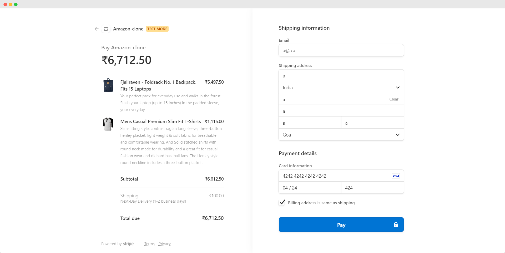

<a name="readme-top"></a>

[![License][license-shield]][license-url]

<div align="center">

  <h1 align="center">Amazon Clone</h1>
  
  <p align="center">
An Amazon clone with complete functionality of signing in, payments, and order history
    <br />
    <a href="https://amazon.bhavyansh.codes/"><i>View Demo</i></a>
  </p>
</div>

<br/>

<!-- TABLE OF CONTENTS -->
<details>
  <summary>Table of Contents</summary>
  <ol>
    <li>
      <a href="#about">About</a>
      <ul>
        <li><a href="#built-with">Built With</a></li>
      </ul>
    </li>
    <li>
      <a href="#getting-started">Getting Started</a>
      <ul>
        <li><a href="#prerequisites">Prerequisites</a></li>
        <li><a href="#installation">Installation</a></li>
      </ul>
    </li>
    <li><a href="#usage">Usage</a></li>
    <li><a href="#contributing">Contributing</a></li>
    <li><a href="#license">License</a></li>
    <li><a href="#contact">Contact</a></li>
  </ol>
</details>

<!-- ABOUT THE PROJECT -->

### About

An Amazon clone which is a e-commerce website. It has complete functionality of signing in using google, products are displayed using FakeStore API, cart using redux, payments using stripe, and order history using firebase and stripe Webhooks. UI has been designed using Tailwind CSS.

#### Built With

- [![nextjs][next.js]][nextjs-url]
- [![reactjs][react.js]][reactjs-url]
- [![tailwindcss][tailwindcss]][tailwindcss-url]
- [![redux][redux]][redux-url]
- [![firebase][firebase]][firebase-url]
- [![stripe][stripe]][stripe-url]

<p align="right">(<a href="#readme-top">back to top</a>)</p>

<!-- GETTING STARTED -->

## Getting Started

This is how you may set up your project locally.
To get a local copy up and running follow these simple steps.

### Prerequisites

You must have the following installed on your local machine.

- npm package manager
- yarn `npm install --global yarn`

### Installation

1. Fork the repo
2. Clone it to your local computer
   ```sh
   git clone https://github.com/your_username_/Project-Name.git
   ```
3. Install NPM packages using yarn
   ```sh
   yarn
   ```
4. Enter your Environment variables in `.env.local` file

   ```sh
    GOOGLE_ID= Get it from google cloud console
    GOOGLE_SECRET= Get it from google cloud console
    NEXTAUTH_URL=http://localhost:3000
    NEXTAUTH_SECRET= Get it from https://generate-secret.vercel.app/

    NEXT_PUBLIC_STRIPE_PUBLIC_KEY= Get it from stripe dashboard
    STRIPE_SECRET_KEY= Get it from stripe dashboard
    STRIPE_SHIPPING_RATE= Get it from stripe dashboard
    STRIPE_SIGNING_SECRET= Get it from stripe dashboard

    FIREBASE_API_KEY= Get it from firebase console
    FIREBASE_AUTH_DOMAIN= Get it from firebase console
    FIREBASE_PROJECT_ID= Get it from firebase console
    FIREBASE_STORAGE_BUCKET= Get it from firebase console
    FIREBASE_MESSAGING_SENDER_ID= Get it from firebase console
    FIREBASE_APP_ID= Get it from firebase console

    PERMISSIONS_PROJECT_ID= Get it from firebase console
    PERMISSIONS_PRIVATE_KEY_ID= Get it from firebase console
    PERMISSIONS_PRIVATE_KEY= Get it from firebase console
    PERMISSIONS_CLIENT_EMAIL= Get it from firebase console
    PERMISSIONS_CLIENT_ID= Get it from firebase console
    PERMISSIONS_AUTH_URI= Get it from firebase console
    PERMISSIONS_TOKEN_URI= Get it from firebase console
    PERMISSIONS_AUTH_PROVIDER_X509_CERT_URL= Get it from firebase console
    PERMISSIONS_CLIENT_X509_CERT_URL= Get it from firebase console
   ```

5. Run the development server:
   ```bash
   yarn dev
   ```
6. Open [http://localhost:3000](http://localhost:3000) with your browser to see the result.

<p align="right">(<a href="#readme-top">back to top</a>)</p>

<!-- USAGE EXAMPLES -->

## Usage

1. Home page

   

1. Cart page

   

1. Payments page

   

1. Order History page

   

<p align="right">(<a href="#readme-top">back to top</a>)</p>

<!-- CONTRIBUTING -->

## Contributing

Contributions are what make the open source community such an amazing place to learn, inspire, and create. Any contributions you make are **greatly appreciated**.

If you have a suggestion that would make this better, please fork the repo and create a pull request. You can also simply open an issue with the tag "enhancement".
Don't forget to give the project a star! Thanks again!

1. Fork the Project
2. Create your Feature Branch (`git checkout -b feature/AmazingFeature`)
3. Commit your Changes (`git commit -m 'Add some AmazingFeature'`)
4. Push to the Branch (`git push origin feature/AmazingFeature`)
5. Open a Pull Request

<p align="right">(<a href="#readme-top">back to top</a>)</p>

<!-- LICENSE -->

## License

Distributed under the MIT License. See [LICENSE](LICENSE) for more information.

<p align="right">(<a href="#readme-top">back to top</a>)</p>

<!-- CONTACT -->

## Contact

Twitter - [@BhavyanshJain](https://twitter.com/Bhavyansh_Jain_)

Project Link: [https://github.com/BhavyanshJain/amazon-clone](https://github.com/BhavyanshJain/amazon-clone)

<p align="right">(<a href="#readme-top">back to top</a>)</p>

<!-- MARKDOWN LINKS & IMAGES -->

[license-shield]: https://img.shields.io/github/license/BhavyanshJain/amazon-clone
[license-url]: https://github.com/BhavyanshJain/amazon-clone/blob/master/LICENSE
[next.js]: https://img.shields.io/badge/Next.js-000000?style=for-the-badge&logo=nextdotjs&logoColor=white
[nextjs-url]: https://nextjs.org/
[react.js]: https://img.shields.io/badge/React.js-20232A?style=for-the-badge&logo=react&logoColor=61DAFB
[reactjs-url]: https://reactjs.org/
[tailwindcss]: https://img.shields.io/badge/TailwindCSS-06B6D4?style=for-the-badge&logo=tailwindcss&logoColor=white
[tailwindcss-url]: https://tailwindcss.com/
[redux]: https://img.shields.io/badge/Redux-593D88?style=for-the-badge&logo=redux&logoColor=white
[redux-url]: https://redux.js.org/
[firebase]: https://img.shields.io/badge/Firebase-FFCA28?style=for-the-badge&logo=firebase&logoColor=black
[firebase-url]: https://firebase.google.com/
[stripe]: https://img.shields.io/badge/Stripe-008CDD?style=for-the-badge&logo=stripe&logoColor=white
[stripe-url]: https://stripe.com/
